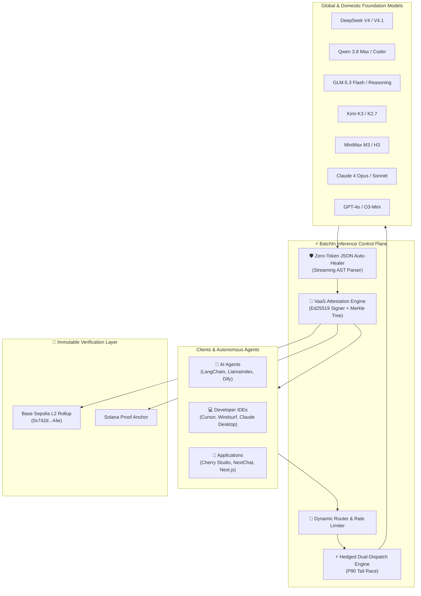

<div align="center">

```
  ____            _         _     ___       
 | __ )   __ _  | |_  ___ | |__ |_ _| _ __  
 |  _ \  / _` | | __|/ __|| '_ \ | | | '_ \ 
 | |_) || (_| | | |_| (__ | | | || | | | | |
 |____/  \__,_|  \__|\___||_| |_||___||_| |_|
```

### ⚡ Ultra-Reliable AI Inference Gateway & Verifiable Agent Control Plane

*50+ Flagship Models · Hedged Dual-Dispatch · Zero-Token JSON Auto-Healer · VaaS On-Chain Attestation · Drop-in OpenAI / Vercel AI SDK / LangChain / FastMCP*

<p align="center">
  <a href="https://github.com/aw3703/batchin-public/stargazers"></a>
  <a href="https://github.com/aw3703/batchin-public/network/members"></a>
  <a href="LICENSE"></a>
  <a href="https://github.com/aw3703/batchin-public/actions/workflows/ci.yml"></a>
</p>

<p align="center">
  <a href="https://www.npmjs.com/package/@batchin/sdk"></a>
  <a href="https://pypi.org/project/batchin/"></a>
  <a href="packages/ai-sdk"></a>
  <a href="https://batchin.tech/.well-known/mcp"></a>
  <a href="https://sepolia.basescan.org/address/0x742d35Cc6634C0532925a3b844Bc454e4438f44e"></a>
  <a href="https://github.com/aw3703/batchin-public/actions/workflows/compliance.yml"></a>
</p>

<p align="center">
  <a href="README.md"><b>English</b></a> •
  <a href="README_CN.md"><b>简体中文</b></a> •
  <a href="https://batchin.tech"><b>Official Website</b></a> •
  <a href="docs/rfcs"><b>Formal RFCs</b></a> •
  <a href="https://api.batchin.tech/openapi.json"><b>API Reference</b></a> •
  <a href="https://github.com/aw3703/batchin-public/discussions"><b>Community Discussions</b></a>
</p>

<p align="center">
  <a href="https://colab.research.google.com/github/aw3703/batchin-public/blob/main/examples/notebooks/batchin_master_quickstart.ipynb"></a>
  <a href="docs/rfcs"></a>
</p>

</div>

---

## 💡 What is BatchIn?

**BatchIn** is an enterprise-grade, high-availability AI inference gateway and cryptographic control plane engineered for modern autonomous agents and mission-critical applications. 

Traditional model routers leave production systems vulnerable to upstream provider outages, 504 timeouts, malformed JSON outputs, and unverified AI hallucinations. BatchIn solves these fundamental developer pain points with **Hedged Dual-Dispatch**, **Zero-Token JSON Auto-Healing**, **VaaS (Verifiable AI as a Service) on-chain cryptographic receipts**, and **native Model Context Protocol (MCP)** support.



---

## 🚀 Key Superpowers

### 1. ⚡ Hedged Dual-Dispatch (Eliminate 504s & Slashes P99 Latency by 60%)
Upstream foundation model providers frequently stutter or queue during peak traffic. BatchIn monitors Time-to-First-Token (TTFT). When a primary route exceeds the P90 latency threshold, a secondary backup provider is dispatched in parallel. The gateway streams whichever responds first and cancels the loser, virtually eliminating tail latency spikes and timeouts.

### 2. 🛡️ Zero-Token JSON Auto-Healer
Autonomous agents frequently crash because LLMs emit truncated JSON, unclosed brackets, markdown backticks, or trailing commas. BatchIn's client-side streaming AST parser repairs broken structures in real-time at **zero additional token cost** without costly LLM re-prompt loops.

### 3. 📜 VaaS (Verifiable AI as a Service) Cryptographic Proofs
Every generation can be proven in court or enterprise audits:
- **RFC 8032 Ed25519** digital signatures guaranteeing provider authenticity.
- **SHA-256 Merkle Inclusion Proofs** preserving prompt privacy while verifying output integrity.
- **On-Chain Anchors** on Base Sepolia L2 (`0x742d35Cc6634C0532925a3b844Bc454e4438f44e`) and Solana.

### 4. 🤖 0-Day Support for 2026 Golden Flagship Models
Instant, unified access to the most powerful reasoning and coding models:
- **DeepSeek**: `deepseek-v4-pro` (1.8T MoE Deep Reasoning), `deepseek-v4-flash`, `deepseek-v4.1-flash`
- **Qwen (Alibaba)**: `qwen3.8-max` (2.4T Super MoE, 1M Context), `qwen-image-3.0-pro`
- **GLM (Zhipu AI)**: `glm-5.3` (Full-modal Agent Reasoning), `glm-5.3-flash`
- **Kimi (Moonshot)**: `kimi-k3` (Recursive Deep Think), `kimi-k2.7-code`
- **MiniMax**: `minimax-m3` (Linear-Attention Multimodal), `minimax-h3` (Video)

### 5. 💳 Autonomous Agent x402 Micropayments
Built for machine-to-machine economies: AI agents can pay per request with native HTTP 402 Payment Required headers using crypto micropayments or dedicated sub-account quotas.

---

## 📊 Comparison Matrix

| Feature / Capability | BatchIn | LiteLLM | Portkey | OpenRouter | Cloudflare AI |
| :--- | :---: | :---: | :---: | :---: | :---: |
| **2026 Domestic Golden Models** (`deepseek-v4`, `qwen3.8`, `glm-5.3`) | **Native / 0-Day** | Community | Partial | Limited | No |
| **Hedged Dual-Dispatch (Tail Race)** | **Built-in** | Manual | No | No | No |
| **Zero-Token JSON Auto-Healer** | **Built-in** | No | Gateway Rule | No | No |
| **VaaS Cryptographic Attestation (Base L2)** | **Native** | No | No | No | No |
| **Model Context Protocol (FastMCP 8 Tools)** | **Native FastMCP** | Third-party | No | No | No |
| **Vercel AI SDK 4.x Provider (`@batchin/ai-sdk`)** | **Official** | Via Shim | Via Shim | Via Shim | Via Shim |
| **x402 Agent Debit Settlement** | **Native** | No | No | No | No |
| **US EAR & OFAC 100% Software Compliance** | **Yes** | Yes | Yes | Yes | Yes |

---

## ⚡ Quickstart (30 Seconds)

### Option A: Drop-in Replacement for Official OpenAI SDK (Python)

Simply change `base_url` to `https://api.batchin.tech/v1`. Works instantly with any existing OpenAI codebase!

```python
from openai import OpenAI

client = OpenAI(
    base_url="https://api.batchin.tech/v1",
    api_key="your-batchin-api-key"
)

response = client.chat.completions.create(
    model="deepseek-v4-pro",
    messages=[{"role": "user", "content": "Explain Merkle trees in one sentence."}],
)
print(response.choices[0].message.content)
```

---

### Option B: Official TypeScript SDK with JSON Auto-Healer

```bash
npm install @batchin/sdk
```

```typescript
import { BatchIn, JsonAutoHealer } from "@batchin/sdk";

const client = new BatchIn({
  apiKey: process.env.BATCHIN_API_KEY,
});

// 1. OpenAI-compatible chat completion
const completion = await client.chat.completions.create({
  model: "deepseek-v4-pro",
  messages: [{ role: "user", content: "Output a JSON list of 3 prime numbers." }],
});

// 2. Guaranteed valid JSON with Zero-Token Auto-Healer
const safeJson = JsonAutoHealer.repair(completion.choices[0].message.content);
console.log(safeJson);
```

---

### Option C: Vercel AI SDK 4.x (`@batchin/ai-sdk`)

```bash
npm install @batchin/ai-sdk ai
```

```typescript
// app/api/chat/route.ts (Next.js App Router)
import { batchin } from "@batchin/ai-sdk";
import { streamText } from "ai";

export async function POST(req: Request) {
  const { messages } = await req.json();

  const result = await streamText({
    model: batchin("deepseek-v4-pro"),
    messages,
  });

  return result.toDataStreamResponse();
}
```

---

### Option D: Model Context Protocol (MCP) for Cursor & Claude Desktop

BatchIn includes a certified FastMCP server with 8 production tools (`chat_completion`, `vaas_verify_receipt`, `batchin_query_pricing`, `batchin_agent_trace_run`, etc.).

Add to your **Claude Desktop** config (`claude_desktop_config.json`) or **Cursor** (`.cursor/mcp.json`):

```json
{
  "mcpServers": {
    "batchin": {
      "command": "python3",
      "args": ["-m", "batchin_mcp.server"],
      "env": {
        "BATCHIN_API_KEY": "your-batchin-api-key"
      }
    }
  }
}
```

---

### Option E: Desktop Clients (Cherry Studio, NextChat, Chatbox, Dify)

Configure BatchIn in your favorite AI desktop GUI:

- **API Host / Base URL**: `https://api.batchin.tech/v1`
- **API Key**: `your-batchin-api-key`
- **Model List**: `deepseek-v4-pro`, `deepseek-v4-flash`, `qwen3.8-max`, `glm-5.3`, `kimi-k3`

---

### Option F: Instant Developer CLI

Run directly via local monorepo (instant, zero setup):
```bash
git clone https://github.com/aw3703/batchin-public.git
cd batchin-public

# Cryptographically verify a VaaS inference receipt
npm run cli -- verify rec_98bf12

# Benchmark TTFT & TPS across models
npm run cli -- bench deepseek-v4-flash

# List available models & pricing
npm run cli -- models
```

Or execute via npx (registry package):
```bash
npx @batchin/cli verify rec_98bf12
npx @batchin/cli bench deepseek-v4-flash
```

---

### Option G: Instant cURL

```bash
curl https://api.batchin.tech/v1/chat/completions \
  -H "Content-Type: application/json" \
  -H "Authorization: Bearer $BATCHIN_API_KEY" \
  -d '{
    "model": "deepseek-v4-flash",
    "messages": [{"role": "user", "content": "Hello BatchIn!"}]
  }'
```

---

## 📦 Monorepo Workspace Packages

| Package | Ecosystem | Description | Directory |
| :--- | :---: | :--- | :--- |
| **`@batchin/sdk`** | npm | Modern TypeScript SDK with OpenAI drop-in compatibility, streaming & resilience | [`packages/sdk-ts`](packages/sdk-ts) |
| **`@batchin/ai-sdk`** | npm | Vercel AI SDK 4.x official provider for fullstack agent orchestration | [`packages/ai-sdk`](packages/ai-sdk) |
| **`batchin`** | PyPI | Official Python SDK with Sync, Async, LangChain adapter & streaming | [`packages/sdk-python`](packages/sdk-python) |
| **`@batchin/cli`** | npm | Developer CLI for model discovery, latency benchmarking, and VaaS audits | [`packages/cli-ts`](packages/cli-ts) |
| **`batchin-mcp-server`** | PyPI | Model Context Protocol server exposing 8 production agent tools | [`packages/mcp-server`](packages/mcp-server) |
| **`@batchin/vaas`** | npm | VaaS TypeScript cryptographic receipt verifier powered by `viem` v2 & Base L2 | [`packages/vaas-sdk-ts`](packages/vaas-sdk-ts) |
| **`batchin-vaas`** | PyPI | VaaS Python SDK and offline cryptographic bundle verifier | [`packages/vaas-sdk-python`](packages/vaas-sdk-python) |
| **`@batchin/contracts`** | npm / Sol | Solidity smart contracts for Base Sepolia on-chain registry | [`packages/contracts`](packages/contracts) |

---

## 🤖 Supported Models (2026 Flagships)

BatchIn routes production workloads across high-availability clusters:

| Model ID | Provider | Context Window | Key Strengths |
| :--- | :--- | :---: | :--- |
| **`deepseek-v4-pro`** | DeepSeek | 128K | 1.8T MoE Deep Reasoning, Math & System Architecture |
| **`deepseek-v4-flash`** | DeepSeek | 128K | Ultra-low latency, High TPS throughput |
| **`qwen3.8-max`** | Alibaba Cloud | 1,000K | 2.4T Super MoE, 1M context document reasoning & agent planning |
| **`glm-5.3`** | Zhipu AI | 128K | Full-modal agent reasoning & multi-step tool execution |
| **`kimi-k3`** | Moonshot | 200K | Recursive deep think, complex coding & search |
| **`minimax-m3`** | MiniMax | 1,000K | Linear-Attention Multimodal & lightning fast long context |
| **`claude-4-opus`** | Anthropic | 200K | Top-tier autonomous coding & creative problem solving |
| **`gpt-4o`** | OpenAI | 128K | Standard multimodal vision & language benchmark |

---

## 📜 Verifying VaaS Cryptographic Receipts

BatchIn is the first inference gateway providing **Proof-of-Inference**. Every response can include an cryptographic attestation header.

Verify any receipt in 2 lines with `@batchin/vaas`:

```typescript
import { VaasVerifier } from "@batchin/vaas";

const isValid = await VaasVerifier.verify({
  recordId: "rec_98bf12",
  merkleRoot: "0x123abc...",
  proof: ["0xdef...", "0x456..."],
  leafHash: "0x789...",
  contractAddress: "0x742d35Cc6634C0532925a3b844Bc454e4438f44e",
});

console.log("Cryptographic Proof Valid:", isValid);
```

---

## 🔒 Security & US Export Compliance

1. **100% Software Control Plane**: BatchIn is strictly an application-layer routing protocol and software SDK. It does not sell, lease, or export physical compute hardware.
2. **Dedicated Quota Management**: Compute allocations are handled as software quotas (`Tokens Per Second`, `Reserved Throughput`).
3. **Zero Data Retention (ZDR)**: Ephemeral memory buffers discard inference prompts immediately after streaming. Cryptographic receipts store only one-way cryptographic SHA-256 hashes, ensuring zero user data exposure.
4. **EAR & OFAC Compliant**: Formally verified against US Export Administration Regulations and sanctions lists.

---

## 📈 Star History

If you find BatchIn useful for your agents or production infrastructure, **please give us a ⭐️ on GitHub!** It inspires us to keep adding new flagship models and maintaining open-source SDKs.

<div align="center">
  <a href="https://star-history.com/#aw3703/batchin-public&Date">
    
  </a>
</div>

---

## 🤝 Contributing

We welcome community contributions, model additions, and bug fixes! Please check out [CONTRIBUTING.md](CONTRIBUTING.md) to get started.

- [Request a new Model / Provider](https://github.com/aw3703/batchin-public/issues/new?template=model_request.yml)
- [Report a Bug](https://github.com/aw3703/batchin-public/issues/new?template=bug_report.yml)
- [Request a Feature](https://github.com/aw3703/batchin-public/issues/new?template=feature_request.yml)

---

## 📄 License

Licensed under the [Apache License, Version 2.0](LICENSE).
