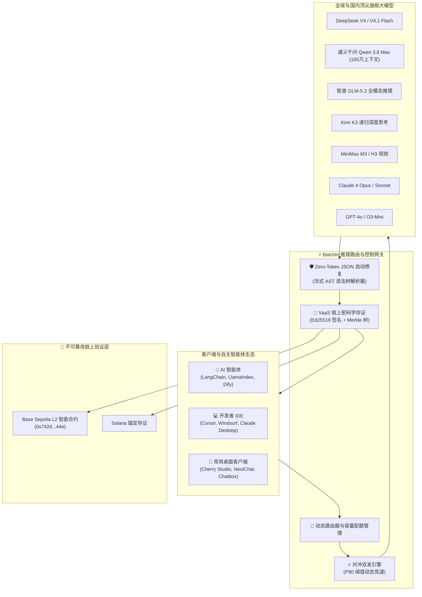

<div align="center">

```
  ____            _         _     ___       
 | __ )   __ _  | |_  ___ | |__ |_ _| _ __  
 |  _ \  / _` | | __|/ __|| '_ \ | | | '_ \ 
 | |_) || (_| | | |_| (__ | | | || | | | | |
 |____/  \__,_|  \__|\___||_| |_||___||_| |_|
```

### ⚡ 下一代高可靠 AI 推理网关与可验证智能体控制台

*50+ 旗舰大模型 · 对冲双发消灭长尾毛刺 · 零 Token 消耗 JSON 自动修复 · VaaS 链上密码学存证 · 完美平替 OpenAI / Vercel AI SDK / LangChain / FastMCP*

<p align="center">
  <a href="https://github.com/aw3703/batchin-public/stargazers"></a>
  <a href="https://github.com/aw3703/batchin-public/network/members"></a>
  <a href="LICENSE"></a>
  <a href="https://github.com/aw3703/batchin-public/actions/workflows/ci.yml"></a>
</p>

<p align="center">
  <a href="https://www.npmjs.com/package/@batchin/sdk"></a>
  <a href="https://pypi.org/project/batchin/"></a>
  <a href="packages/ai-sdk"></a>
  <a href="https://batchin.tech/.well-known/mcp"></a>
  <a href="https://sepolia.basescan.org/address/0x742d35Cc6634C0532925a3b844Bc454e4438f44e"></a>
  <a href="https://github.com/aw3703/batchin-public/actions/workflows/compliance.yml"></a>
</p>

<p align="center">
  <a href="README.md"><b>English</b></a> •
  <a href="README_CN.md"><b>简体中文</b></a> •
  <a href="https://batchin.tech"><b>官网平台</b></a> •
  <a href="https://api.batchin.tech/openapi.json"><b>API 规范</b></a> •
  <a href="https://github.com/aw3703/batchin-public/discussions"><b>社区讨论区</b></a>
</p>

</div>

---

## 💡 为什么选择 BatchIn？

在大规模生产环境与自主智能体（Autonomous Agents）构建中，开发者普遍面临四大致命痛点：
1. **上游服务不稳定**：晚高峰厂商限流、偶发 504 响应超时、长尾时延（P99）高昂；
2. **模型输出语法畸变**：LLM 输出 JSON 时缺少闭合括号、多出末尾逗号或被 Markdown 语法包裹，导致 Agent 直接崩溃；
3. **缺乏法律与合规存证**：金融、医疗或政企系统无法证明某条关键决策确由特定模型在特定时间生成且未经中间人篡改；
4. **多模型接入繁琐**：各大厂商 API 协议碎片化，降级容灾逻辑需要反复手写。

**BatchIn** 专为解决上述痛点而生，提供：
- ⚡ **对冲双发（Hedged Dual-Dispatch）**：智能竞速备用上游，彻底抹平 P99 毛刺，减少 60% 长尾时延并杜绝超时；
- 🛡️ **Zero-Token JSON 自动修复**：客户端流式 AST 语法树实时补全，**零 Token 消耗、零二次重试延迟**；
- 📜 **VaaS（可验证 AI 即服务）**：基于 RFC 8032 Ed25519 签名与 SHA-256 Merkle 树，将不可篡改的存证上链至 Base L2 与 Solana；
- 🤖 **主流生态零代码接入**：100% 兼容 OpenAI 格式，即插即用 Cherry Studio、Chatbox、Dify、NextChat、Cursor、Claude Desktop 与 Vercel AI SDK。



---

## 🚀 核心特性与技术优势

### 1. ⚡ 对冲双发机制（消灭 504 超时，P99 时延降低 60%）
在模型推理网关中，单点上游的偶发拥堵是导致用户体验断崖式下跌的主因。BatchIn 实时监测首字延迟（TTFT）。一旦主路由耗时超过历史 P90 阈值，网关会自动异步触发备用供应商进行竞速。谁先返回首字即流式吐给客户端并即刻取消落后请求，彻底消除生产环境中的超时风险。

### 2. 🛡️ Zero-Token JSON 自动修复（告别 Agent 崩溃循环）
在智能体执行复杂工具调用或结构化输出时，模型常常因最大 Token 截断或格式偏差吐出无效 JSON。BatchIn 内置流式 AST 语法修复器，自动修复：
- 截断未闭合的括号 `{ [ "`
- 末尾多余的逗号 `,`
- 外层包裹的 ````json ``` Markdown 标记
- **整个过程在本地毫秒级完成，不需要让大模型重新生成，节约 100% 修复 Token 成本！**

### 3. 📜 VaaS 链上密码学存证（可向法庭或审计机构出示的推理凭证）
BatchIn 是首个提供真正意义上“推理证明”（Proof-of-Inference）的网关平台：
- **Ed25519 签名**：确保生成内容 100% 出自 BatchIn 官方节点；
- **SHA-256 Merkle 包含证明**：在严格保护用户原始 Prompt 隐私的前提下，证明输入与输出哈希已包含在区块批次中；
- **Base L2 公链上链**：智能合约部署于 Base Sepolia（`0x742d35Cc6634C0532925a3b844Bc454e4438f44e`），任何第三方均可通过区块浏览器或开源 SDK 离线检验。

### 4. 🤖 零日（0-Day）直连国内 2026 旗舰大模型
全面支持国内最强推理与长文本模型：
- **DeepSeek**：`deepseek-v4-pro`（1.8T MoE 深度推理）、`deepseek-v4-flash`
- **通义千问 (阿里)**：`qwen3.8-max`（2.4T MoE，支持 100 万超长上下文）、`qwen-image-3.0-pro`
- **智谱清言 (GLM)**：`glm-5.3`（全模态 Agent 推理）、`glm-5.3-flash`
- **月之暗面 (Kimi)**：`kimi-k3`（递归慢思考架构）、`kimi-k2.7-code`
- **MiniMax**：`minimax-m3`（线性注意力超快大模型）

---

## 📊 横向架构对比（BatchIn vs 传统网关）

| 功能维度 | BatchIn | LiteLLM | Portkey | OpenRouter | 传统 OneAPI / NewAPI |
| :--- | :---: | :---: | :---: | :---: | :---: |
| **国内 2026 黄金模型即刻支持** | **原生 0-Day** | 社区更新 | 部分支持 | 支持有限 | 依赖自行配 key |
| **对冲双发竞速 (Hedged Dual-Dispatch)** | **原生内置** | 需手写逻辑 | 无 | 无 | 无 |
| **零 Token JSON 自动语法修复** | **原生内置** | 无 | 网关规则拦截 | 无 | 无 |
| **VaaS 密码学链上存证 (Base L2)** | **原生支持** | 无 | 无 | 无 | 无 |
| **Model Context Protocol (FastMCP 8 工具)** | **原生认证** | 第三方插件 | 无 | 无 | 无 |
| **Vercel AI SDK 4.x 官方 Provider** | **官方包** | 需 Shim 转接 | 需 Shim 转接 | 需 Shim 转接 | 需 Shim 转接 |
| **自主智能体 x402 微支付代扣** | **原生支持** | 无 | 无 | 无 | 无 |
| **美国 EAR & OFAC 出口合规认证** | **100% 纯软件合规**| 软件 | 软件 | 聚合商 | 自建 |

---

## ⚡ 30 秒极速上手

### 方式一：一行修改 OpenAI 官方 SDK (Python)

只需将 `base_url` 指向 `https://api.batchin.tech/v1`，无需重写现有业务代码！

```python
from openai import OpenAI

client = OpenAI(
    base_url="https://api.batchin.tech/v1",
    api_key="your-batchin-api-key"
)

response = client.chat.completions.create(
    model="deepseek-v4-pro",
    messages=[{"role": "user", "content": "用一句话解释 Merkle 树的原理"}],
)
print(response.choices[0].message.content)
```

---

### 方式二：官方 TypeScript SDK 与 JSON 自动修复

```bash
npm install @batchin/sdk
```

```typescript
import { BatchIn, JsonAutoHealer } from "@batchin/sdk";

const client = new BatchIn({
  apiKey: process.env.BATCHIN_API_KEY,
});

// 1. 发起推理请求
const completion = await client.chat.completions.create({
  model: "deepseek-v4-pro",
  messages: [{ role: "user", content: "输出包含 3 个质数的 JSON 列表" }],
});

// 2. 使用 Zero-Token Auto-Healer 确保 JSON 解析永不崩溃
const safeJson = JsonAutoHealer.repair(completion.choices[0].message.content);
console.log(safeJson);
```

---

### 方式三：Next.js 全栈框架与 Vercel AI SDK 4.x

```bash
npm install @batchin/ai-sdk ai
```

```typescript
// app/api/chat/route.ts (Next.js App Router)
import { batchin } from "@batchin/ai-sdk";
import { streamText } from "ai";

export async function POST(req: Request) {
  const { messages } = await req.json();

  const result = await streamText({
    model: batchin("deepseek-v4-pro"),
    messages,
  });

  return result.toDataStreamResponse();
}
```

---

### 方式四：Cherry Studio / Chatbox / NextChat / Dify 客户端配置

在任何支持 OpenAI 格式的桌面客户端中快速配置：

- **API 域名 (Base URL)**: `https://api.batchin.tech/v1`
- **API Key**: `your-batchin-api-key`
- **推荐模型填入**: `deepseek-v4-pro`, `deepseek-v4-flash`, `qwen3.8-max`, `glm-5.3`, `kimi-k3`

---

### 方式五：Claude Desktop / Cursor 的 MCP 协议插件

BatchIn 提供认证级 FastMCP 服务，向 Cursor、Windsurf、Claude Desktop 暴露 8 个核心生产级智能体工具：

在 `claude_desktop_config.json` 或 `.cursor/mcp.json` 中添加：

```json
{
  "mcpServers": {
    "batchin": {
      "command": "python3",
      "args": ["-m", "batchin_mcp.server"],
      "env": {
        "BATCHIN_API_KEY": "your-batchin-api-key"
      }
    }
  }
}
```

---

### 方式六：开发者专属 CLI

```bash
# 查询当前可用模型列表与计费
npx @batchin/cli models

# 快速发起交互式测试
npx @batchin/cli chat "解释零数据留存机制" --model deepseek-v4-flash

# 实时测试 TTFT 与 TPS 吞吐表现
npx @batchin/cli bench deepseek-v4-flash

# 验证 VaaS 链上存证凭证
npx @batchin/cli verify rec_98bf12
```

---

### 方式七：cURL 一键调用

```bash
curl https://api.batchin.tech/v1/chat/completions \
  -H "Content-Type: application/json" \
  -H "Authorization: Bearer $BATCHIN_API_KEY" \
  -d '{
    "model": "deepseek-v4-flash",
    "messages": [{"role": "user", "content": "你好，BatchIn！"}]
  }'
```

---

## 📦 开源单体仓库子包矩阵

| 软件包 | 生态 | 功能描述 | 目录 |
| :--- | :---: | :--- | :--- |
| **`@batchin/sdk`** | npm | 现代 TypeScript SDK，集成 OpenAI 兼容接口、流式与容灾中间件 | [`packages/sdk-ts`](packages/sdk-ts) |
| **`@batchin/ai-sdk`** | npm | Vercel AI SDK 4.x 官方 Provider，提供全栈流式智能体支持 | [`packages/ai-sdk`](packages/ai-sdk) |
| **`batchin`** | PyPI | 官方 Python SDK，内置同步、异步、LangChain 适配器与流式处理 | [`packages/sdk-python`](packages/sdk-python) |
| **`@batchin/cli`** | npm | 终端 CLI 工具，支持模型发现、基准压测与 VaaS 审计 | [`packages/cli-ts`](packages/cli-ts) |
| **`batchin-mcp-server`** | PyPI | 官方 Model Context Protocol 协议服务，暴露 8 项生产级工具 | [`packages/mcp-server`](packages/mcp-server) |
| **`@batchin/vaas`** | npm | VaaS TypeScript 存证验证器，基于 `viem` v2 与 Base L2 | [`packages/vaas-sdk-ts`](packages/vaas-sdk-ts) |
| **`batchin-vaas`** | PyPI | VaaS Python 存证验证 SDK 与离线校验工具 | [`packages/vaas-sdk-python`](packages/vaas-sdk-python) |
| **`@batchin/contracts`** | npm / Sol | Base Sepolia 链上存证智能合约与 ABI 规范 | [`packages/contracts`](packages/contracts) |

---

## 🤖 旗舰模型支持一览表

| 模型标识 (Model ID) | 研发厂商 | 上下文窗口 | 核心优势与适用场景 |
| :--- | :--- | :---: | :--- |
| **`deepseek-v4-pro`** | 深度求索 (DeepSeek) | 128K | 1.8T MoE 深度思考架构，极擅数学证明、逻辑推理与系统代码编写 |
| **`deepseek-v4-flash`** | 深度求索 (DeepSeek) | 128K | 超低首字延迟，高并发极速吞吐，性价比之王 |
| **`qwen3.8-max`** | 阿里巴巴 (通义千问) | 1,000K | 2.4T 超大规模 MoE，原生 100 万超长文档推理与智能体复杂规划 |
| **`glm-5.3`** | 智谱 AI (GLM) | 128K | 全模态思考推理，工业级工具调用（Function Calling）稳定性 |
| **`kimi-k3`** | 月之暗面 (Moonshot) | 200K | 递归慢思考，复杂代码重构与实时深度网络检索 |
| **`minimax-m3`** | 稀宇科技 (MiniMax) | 1,000K | 线性注意力机制，超长上下文秒级加载与极速生成 |
| **`claude-4-opus`** | Anthropic | 200K | 全球顶尖编码能力与复杂长程项目决策 |
| **`gpt-4o`** | OpenAI | 128K | 标准多模态图文基准与高通用性问答 |

---

## 🔒 数据安全与合规声明

1. **纯软件控制面**：BatchIn 纯属应用层与协议层软件路由系统与开发者 SDK，不销售、租赁或出口任何实体算力硬件设备。
2. **零数据保留 (ZDR)**：网关执行端到端临时流式转发，推理完成后即刻释放内存，不保存用户 Prompt 与生成全文。
3. **严格遵守美国 EAR 出口条例与 OFAC 限制**：经合规工具持续扫描，确保代码库与 API 服务 100% 保持软件协议合规性。

---

## 📈 Star 历史趋势

如果您觉得 BatchIn 对您的 Agent 开发或大模型业务有帮助，**请为我们点亮一颗 ⭐️ Star！** 您的支持是我们持续免费维护开源 SDK、跟进零日（0-Day）大模型并改进基础设施的最大动力。

<div align="center">
  <a href="https://star-history.com/#aw3703/batchin-public&Date">
    
  </a>
</div>

---

## 🤝 参与贡献与社区

我们极其欢迎广大开发者的 Issue、PR 与模型建议：

- 💡 [提交新模型接入建议 (Model Request)](https://github.com/aw3703/batchin-public/issues/new?template=model_request.yml)
- 🐛 [报告 Bug (Bug Report)](https://github.com/aw3703/batchin-public/issues/new?template=bug_report.yml)
- 🚀 [提出新特性想法 (Feature Request)](https://github.com/aw3703/batchin-public/issues/new?template=feature_request.yml)
- 💬 [加入 GitHub Discussions 社区交流](https://github.com/aw3703/batchin-public/discussions)

---

## 📄 开源许可证

本项目基于 [Apache License, Version 2.0](LICENSE) 开源。
