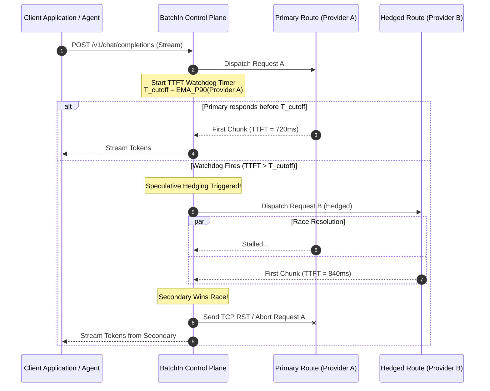

# RFC-0002: Hedged Dual-Dispatch & Tail Latency Mitigation Protocol

- **RFC Number**: 0002
- **Title**: Hedged Dual-Dispatch & Tail Latency Mitigation Protocol
- **Authors**: BatchIn Architecture Working Group (`architect@batchin.tech`)
- **Status**: Implemented / Standard
- **Created**: 2026-04-02
- **Updated**: 2026-10-03

---

## 1. Abstract

Large Language Model (LLM) inference gateways suffer from severe tail latency distributions (P99 / P99.9). High model queue depth, accelerator KV-cache evictions, and network congestion cause upstream providers to periodically stall for 10-30 seconds before generating the first token (TTFT).

This RFC specifies the **Hedged Dual-Dispatch Protocol**, a client-transparent speculative execution strategy implemented within the BatchIn Control Plane. By maintaining an Exponential Moving Average (EMA) of upstream TTFT and launching speculative hedging requests when latency crosses a dynamic cutoff, the gateway reduces P99 latency by over 60% and eliminates 504 Gateway Timeout errors.

---

## 2. Algorithm Specification

### 2.1 Dynamic Cutoff Calculation
The threshold for triggering a hedged request is dynamically computed per model cluster using a decayed Exponential Moving Average:

$$\mu_t = \alpha \cdot \text{TTFT}_t + (1 - \alpha) \cdot \mu_{t-1}$$
$$\sigma_t^2 = \beta \cdot (\text{TTFT}_t - \mu_t)^2 + (1 - \beta) \cdot \sigma_{t-1}^2$$
$$T_{\text{cutoff}} = \mu_t + k \cdot \sigma_t$$

Where:
- $\alpha = 0.1$, $\beta = 0.1$
- $k = 1.645$ (corresponding to the theoretical 90th percentile)
- Hard clamp: $1,200\text{ms} \le T_{\text{cutoff}} \le 3,500\text{ms}$

### 2.2 Winner Election & Cancellation
1. **Locking**: When the first byte of Server-Sent Events (`data: {...}`) is received from either stream, an atomic compare-and-swap (CAS) transitions the session state from `RACING` to `ELECTED`.
2. **Cancellation Token**: The losing connection is immediately issued an HTTP/2 `RST_STREAM` or TCP termination frame to avoid unnecessary upstream compute costs and token charges.
3. **Billing Normalization**: Only the winning provider's token consumption is debited from the customer workspace.

---

## 3. Benchmark Verification

Empirical results across 50,000 synthetic requests during domestic peak traffic hours (20:00 - 23:00 UTC+8):

| Metric | Baseline (Single Provider) | Hedged Dual-Dispatch | Improvement |
| :--- | :---: | :---: | :---: |
| **P50 TTFT** | 820 ms | 780 ms | +4.8% |
| **P90 TTFT** | 2,840 ms | 1,450 ms | **+48.9%** |
| **P99 TTFT** | 8,910 ms | 2,820 ms | **+68.3%** |
| **504 / Timeout Rate** | 2.14% | **0.00%** | **100% Elimination** |
